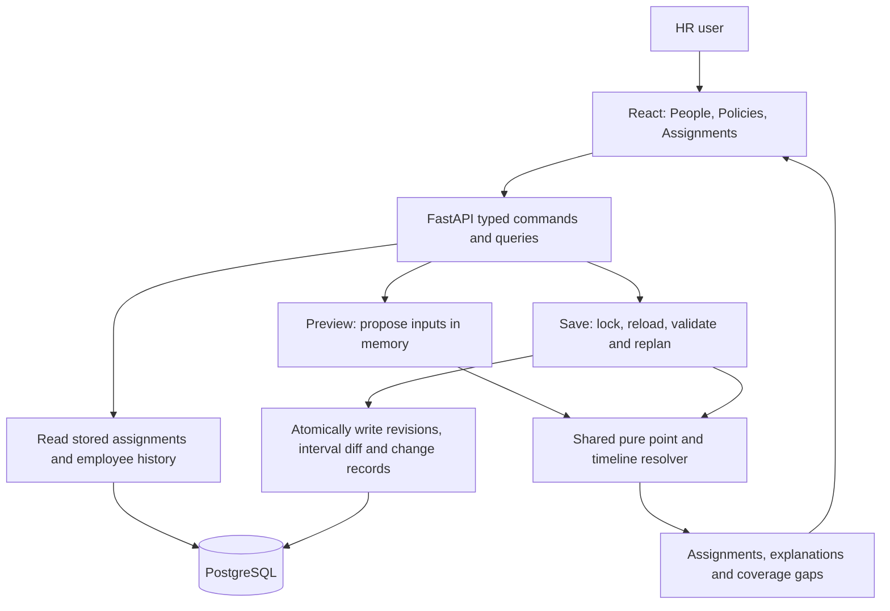

# Policy Assignment System — Design and Tradeoffs

## Overview

The MVP serves one fictional company. HR can create policies and assignment rules, make dated manual exceptions, onboard employees, change employee information and group membership, and preview the resulting assignments before saving. An Assignments report supports arbitrary employee selections and past/future dates. Employee profiles show effective employee history alongside assignment timelines and explanations.

The design prioritizes deterministic behavior, understandable code, and an HR-friendly workflow. It deliberately avoids a distributed rules platform or a general-purpose workflow engine.

## Architecture

The stack is React and TypeScript, FastAPI and Python, and PostgreSQL. SQLAlchemy manages database connections and transactions; explicit parameterized SQL keeps temporal queries and constraints visible. Alembic handles migrations. Docker Compose provides a reproducible local environment, and frontend API types are generated from FastAPI's OpenAPI contract.

The core domain logic is independent of HTTP and database writes. Both previews and saves call the same planners and resolver. Persistence is a separate, explicit step.

## Data model

Stable identities are separated from dated revisions. An employee has an employment record; that employment owns attribute revisions, group memberships, and manual exceptions. This keeps exceptions from implicitly carrying into a later rehire, even though a rehire editor is outside the MVP.

| Tables | Responsibility |
|---|---|
| `employees`, `employments` | Person and employment identities. |
| `employment_versions`, `employee_versions` | Employment dates and effective employee facts: location, department, type, and manager. |
| `departments`, `groups`, `group_memberships` | Lookup identities and dated membership. Conditions reference IDs rather than names. |
| `assignment_categories` | Defines required-single, optional-single, or multiple-policy cardinality. |
| `policies`, `policy_versions` | Policy identity, category, description, and availability dates. |
| `assignment_rules`, `assignment_rule_versions` | Dated conditions, target policy, and ordering. |
| `employee_assignment_overrides` | Dated manual set/add/exclude/clear decisions and their reasons. |
| `employee_assignments` | Resolved employee/category/policy intervals, with structured explanation evidence. |
| `reconciliation_runs`, `assignment_changes` | Actor/reason metadata and snapshots of added or removed assignment intervals. |

Effective intervals use **inclusive starts and exclusive ends**: `[2026-09-12, 2026-10-01)` includes September 30 but not October 1. An absent end means ongoing. API dates remain `YYYY-MM-DD` strings; the frontend does not convert them into timezone-sensitive timestamps. A shared `APP_TODAY` setting makes the seeded demo repeatable.

PostgreSQL exclusion constraints prevent overlapping live revisions and overlapping assignments within a single-policy category. Foreign keys enforce valid relationships. Required coverage is checked by the resolver over employment periods; an exclusion constraint alone cannot guarantee that someone has an assignment.

Recorded revision values cannot be edited or deleted through ordinary updates. Changes supersede old revisions and insert replacements, preserving actor, timestamp, and reason metadata. Assignment intervals are derived data and can be replaced; their previous snapshots remain in assignment-change records.

## Resolution: one answer with an explanation

`resolve(inputs, employee_ids, date)` is the shared point resolver:

It finds each employee's attributes and sees what rules apply per employee for their current state. For example, in some cases, we select the first matching rule (single policy), and in other cases, we have union matching on policies with deduping. Manual policies will also take precedent over anything automatic.

Explanations capture evaluated facts, matched rule versions, contributing sources, and override evidence. Consequently, “Why?” can show both the chosen rule and why another matching rule was not used. The structured evidence is retained even when the HR view hides internal IDs.

## Complete timelines, without a daily correctness job

`resolve_timeline(inputs, employee_id)` evaluates the point resolver at every known date where an answer can change: employment, attribute, membership, policy, rule, and override boundaries, plus the tenure thresholds actually used by rules.

For example, `tenure_months >= 24` contributes one anniversary boundary. `tenure_months equals 24` also contributes the following month's boundary. Tenure uses completed calendar months with anniversary-day clamping, including February 29 hires.

Adjacent intervals merge only when both the policy and its explanation evidence are equivalent. A different source rule may therefore split an interval even if the policy stays the same. The final interval can be open-ended: there is no arbitrary 24-month horizon, coverage-extension action, or daily job required to activate a known transition.

This works because the supported predicates have finite, enumerable change boundaries. Arbitrary scripts or continuously changing conditions are not supported. Future answers also reflect the inputs currently recorded; a later edit may legitimately change a future result.

## Reconciliation and safe writes

Preview constructs proposed revisions in memory and resolves their impact without writing anything. Save acquires a company-wide PostgreSQL transaction lock **before** loading inputs, reloads the latest committed state, and replans the command. It then writes the input revisions, assignment interval differences, and change snapshots in one transaction. Failure rolls back the entire change.

The save response shows the actual saved impact. If inputs changed after preview, the UI flags the difference; it does not silently assume the preview remains authoritative. We deliberately did not add a separate stale-preview approval protocol.

| Input change | Reconciliation behavior |
|---|---|
| Location, department, employment type, or group membership | Recompute the employee, conservatively including relevant managers. Removed memberships are included. |
| Manager reassignment or onboarding | Include the employee and old/new managers, since direct-report status may change their policies. |
| Manual exception | Recompute the employee, including the exception's start and expiration boundaries. |
| Rule edit, end, or reorder | Recompute the whole company, including employees who no longer match. |
| Known tenure threshold or scheduled date arrives | The transition already exists in stored intervals; reads select the applicable result. |

Reconciliation compares canonical old and desired intervals and writes only additions/removals. An unchanged rerun produces no assignment-change records. Evidence-only changes remain auditable, while rule-impact previews distinguish them from actual policy gains or losses.

Reads do not trigger reconciliation. The MVP reads stored intervals, but still loads company inputs for checks and performs some filtering in Python. It is not a fully optimized SQL-only read path. Similarly, input loading and boundary discovery are conservative; targeted employee recomputation does not imply targeted input loading.

## Example: a relocation with a manual pay exception

Suppose Jamie is a salaried US employee in New York. Company rules assign biweekly pay and do not assign California meal-break training. HR has separately set monthly pay from September 12 through October 14.

HR schedules Jamie's relocation to California for October 1:

- Preview shows California training starting October 1, while the manual monthly pay assignment remains in effect.
- Saving updates the employee revision and affected assignment intervals atomically. September's effective facts and policy outcomes remain available.
- On October 15, the override expires and the automatic pay rule resumes. No daily task is needed to make that transition happen.
- Employee history shows the relocation, before/after location, and recorded reason. “View assignments on this date” opens the corresponding assignment report.

For onboarding, required-coverage gaps can be fixed with inline manual policy selections in the same preview/save command. This avoids a dead end where an employee must already exist to receive the override needed to create them.

## HR experience and auditability

The product has three main views: People, Policies, and Assignments. Categories explain whether HR must choose one policy, may leave a category empty, or may assign multiple policies. Forms preview impact before committing changes.

Profiles provide two complementary histories:

- **Employee history** projects hires, relocations, department/manager changes, and group changes from existing revisions. It shows effective dates, before/after values, reasons, and scheduled events without introducing another event store.
- **Assignment timeline** shows policies and explicit exclusions/clears. An exclusion is a real decision, but not a positive assignment, so it is included in the timeline read model rather than represented by a fake assignment row.

These are effective histories, not an audit feed of every click, save, or undo. Superseded revisions and previous assignment snapshots remain stored. The current date query means “what applies on date Z according to the latest recorded history,” not “what did the system believe at an earlier knowledge time?” A full knowledge-time API and searchable audit screen are deferred. Actors are recorded using a fictional HR identity; authentication is not implemented.

## Deliberate tradeoffs

| Choice | Benefit | Cost or limitation |
|---|---|---|
| One service and PostgreSQL | Simple local setup and atomic consistency across inputs and results. | Not a multi-tenant production platform. |
| Stored dated assignments rather than live-only evaluation | Predictable date reads and future transitions; inspectable results. | More storage and write-time computation, especially for explanation changes. |
| Company-wide write lock | Straightforward race prevention and rollback behavior. | Writers serialize; not appropriate for high write throughput. |
| Whole-company rule reconciliation | Correctly includes former matches without a complex dependency index. | Work grows with population, rules, and date boundaries; no production-scale benchmark is claimed. |
| Flat AND conditions and a code field registry | Readable forms, validation, and an understandable resolver. | No nested expressions, arbitrary scripts, or every possible business predicate. |
| Immutable revisions, without a full event-sourced architecture | Preserved evidence and ordinary relational queries. | A complete knowledge-time reconstruction interface remains future work. |
| Reject conflicting scheduled edits | Avoids silently overwriting previously scheduled changes. | No correction/cancellation workflow; HR cannot perform every temporal edit. |
| Shared preview/save logic, revalidated on save | Avoids duplicating business rules and keeps saves correct. | A save may differ from an earlier preview; the UI reports that difference. |

Policy retirement/replacement, identity editing, historical corrections, termination/rehire editors, and past-start onboarding are outside the MVP. Departments, groups, and category cardinalities are seeded rather than managed through dedicated screens. Assigning a policy does not execute payroll, provision an app, or deliver training.

## Developer experience and future scale

The implementation uses ordinary modules rather than a plugin framework: snapshot loading and reconciliation in `assignments.py`, pure resolution and field definitions in `resolver.py`, and explicit command planners in `employees.py`, `overrides.py`, and `rules.py`.

Adding a policy within an existing category is data entry. Adding a field means declaring its type/operators, label, reader, dependencies, and date boundaries. New persisted facts also need a migration and an editing path; lookup fields need ID-backed choices and validation. The registry helps keep validation, rule-builder metadata, and evaluation aligned, but it is not yet an automatic dependency-scoping engine. The [extension guide](docs/extending.md) describes these steps concretely.

If the system grows, the next steps would be tenant ownership and authorization, SQL-level date filtering, narrower dependency-based recomputation that still includes former matches, and more granular locks with coordination for shared rule changes. Payroll or IT delivery would use a transactional outbox and idempotent consumers. These are proposed extensions, not infrastructure built for this demo.

