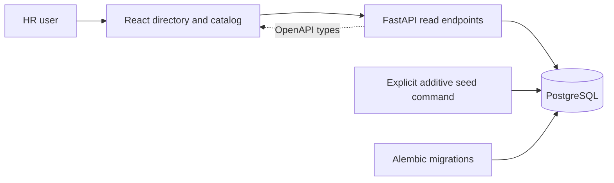
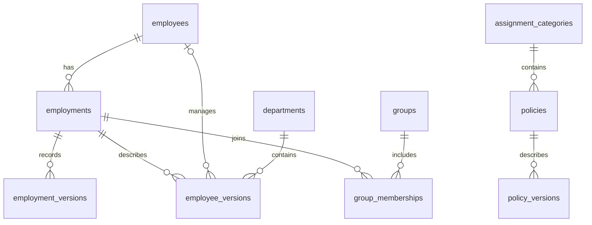

# Architecture — PR 1

## Implemented

The UI uses the API's demo clock date for labels. Backend queries use the same clock, selecting active attribute revisions and a current, upcoming, or most recent employment for directory display. Former/upcoming profiles use the last/first valid employment attributes and are visibly labeled; this directory fallback will not be used as an assignment resolver snapshot. Memberships displayed on profiles are current as of the selected demo date.

Employment identity is stable; dated employment versions store the start and exclusive end. Attribute versions, memberships, and policy versions use the same interval convention. `NULL` ends are unbounded. PostgreSQL exclusion constraints reject overlapping nonsuperseded versions within their logical scope. A trigger prevents edits/deletes to recorded business values and permits supersession metadata to be set once.

The read-only first increment has no editor; seeds create contained attribute/membership periods. The later transactional mutation service must additionally enforce full attribute coverage and interval containment within employment. Rehire identities naturally isolate memberships and future overrides. Actor IDs are fictional labels for now, not authenticated identities.

## Next increments

The resolver will use a registry of typed fields and finite predicate boundaries. Complete stored assignment timelines end in unbounded intervals where appropriate; there is no rolling horizon or read-that-writes path. Rule/employee/group/override changes will use one company transaction lock and synchronous reconciliation. The seed command already takes that lock and will invoke reconciliation before committing once PR 2 adds it.

Input revisions retain source evidence. Assignment-change records preserve prior computed outcomes; a dedicated audit event table and history screen remain deferred. Onboarding/employee edits may include gap-fixing set overrides atomically.

## Tradeoffs

- One database and service are appropriate for a seeded company. A company-wide write lock favors understandable consistency over write concurrency.
- Explicit SQL keeps the interval constraints visible. SQLAlchemy provides parameterization, pooling, and transactions; typed API responses define the client contract.
- The initial company catalog is seeded and read-only. Policy payloads and business-specific execution remain outside the assignment engine.
- At scale, use input dependencies to narrow recomputation, including old and new matches. Per-employee locking would also require shared-rule revision coordination. External delivery would need a transactional outbox and idempotent consumers.
- Tenant isolation and production authentication are future work. Nothing in the local demo represents a production security boundary.

## Implementation references

The API contract uses [FastAPI response models](https://fastapi.tiangolo.com/tutorial/response-model/) for validation and OpenAPI generation. Temporal storage follows [SQLAlchemy's PostgreSQL range and exclusion-constraint documentation](https://docs.sqlalchemy.org/en/20/dialects/postgresql.html). The frontend build uses [Vite](https://vite.dev/guide/).
