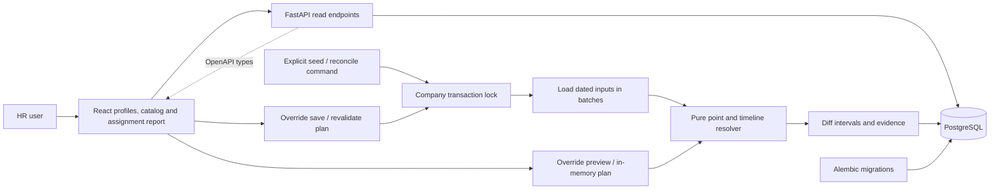
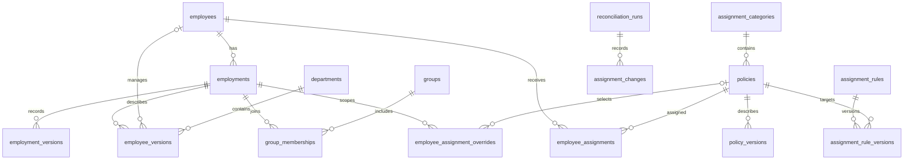

# Architecture — PR 3

## Implemented

The UI uses the API's demo clock date for labels. Backend queries use the same clock, selecting active attribute revisions and a current, upcoming, or most recent employment for directory display. Former/upcoming profiles use the last/first valid employment attributes and are visibly labeled; this directory fallback will not be used as an assignment resolver snapshot. Memberships displayed on profiles are current as of the selected demo date.

Employment identity is stable; dated employment versions store the start and exclusive end. Attribute versions, memberships, and policy versions use the same interval convention. `NULL` ends are unbounded. PostgreSQL exclusion constraints reject overlapping nonsuperseded versions within their logical scope. A trigger prevents edits/deletes to recorded business values and permits supersession metadata to be set once.

Employee/rule editors are still deferred to subsequent increments. Resolution rejects missing or overlapping employee snapshots during employment. The manual override service validates employment containment, category/action compatibility, and policy availability for the full override period. Stable employment identities isolate memberships and overrides from later rehires. Actor IDs are fictional labels, not authenticated identities.

## Resolution and reconciliation

`resolve(inputs, employee_ids, date)` returns assignments and required-coverage gaps. It uses active employments, not the directory's display fallback. Rules are ordered by numeric priority ascending, then stable rule ID. Many-policy categories deduplicate policies while retaining every contributing rule. Tenure uses calendar-month anniversaries, including February 29 clamping. Manager status depends on active direct reports, including their employment start/end dates.

`resolve_timeline(inputs, employee_id)` enumerates finite input and predicate boundaries, resolves segments, and merges adjacent equal results/evidence. The last segment can be unbounded. For simplicity, stored-input boundaries are collected conservatively across the company; irrelevant boundaries merge away. Tenure adds only the boundaries its predicates need. Supported tenure operators are `equals`, `gte`, and `lt`, with integer operands 0–1200 months. There is no rolling horizon or read-that-writes path.

The typed explanation format stores captured category/policy labels, revision references, matching rule evidence, contributing sources, and tie decisions in deterministic order. A changing tenure count is represented by stable threshold truth and the source employment revision. This keeps interval equality meaningful. Future changes in evidence split intervals even when the policy remains unchanged.

`assignment_transaction()` acquires a company lock before input reads at READ COMMITTED isolation. `reconcile()` then loads the complete current inputs, rejects required gaps, diffs canonical intervals, and writes only added/removed rows. Every removal/addition includes a snapshot in assignment-change history, linked to a run. A provenance change is a removal/addition pair. No-op reruns create no run or change rows. Seed uses this same lock and reconciliation transaction. Report reads use a repeatable-read snapshot across their queries.

The report reads stored intervals, identifies dates outside employment, and checks missing required categories independently of policy filters. Unknown employee IDs are rejected. Optional categories can legitimately have no assignment. An explicit empty employee selection returns no results.

## Next increments

Input revisions retain source evidence. Assignment-change records preserve prior computed outcomes; a dedicated audit event table and history screen remain deferred. Onboarding/employee edits will reuse the override planner to include gap-fixing set overrides atomically.

## Manual overrides

`plan_override(inputs, command, today)` validates a typed command and constructs an in-memory revised input set, then resolves the before/after timelines. Preview never writes. Save acquires the company lock, reloads and replans against current inputs, writes revision/supersession records, and reconciles within the same transaction. The UI shows the actual saved result and flags differences from the preview.

Single categories allow set (and clear only for optional categories). Multiple categories allow add/exclude per policy. Replacing an active override ends the earlier period at the new effective date; when the new override expires, automatic rules resume rather than restoring the old override. Returning to automatic assignment uses the same shortening operation and preserves earlier evidence. Conflicts with a later scheduled override are rejected. Duplicate submitted IDs are rejected rather than creating duplicate exceptions.

Source explanations include manual reasons, actor, revision ID, and effective dates. Exclusions and explicit clears remain visible on the profile even when they produce no assignment row. Test data lives in a random temporary schema, so human-created exceptions do not interfere with deterministic tests.

## Tradeoffs

- One database and service are appropriate for a seeded company. A company-wide write lock favors understandable consistency over write concurrency.
- Explicit SQL keeps the interval constraints visible. SQLAlchemy provides parameterization, pooling, and transactions; typed API responses define the client contract.
- The initial company catalog is seeded and read-only. Policy payloads and business-specific execution remain outside the assignment engine.
- At scale, use input dependencies to narrow recomputation, including old and new matches. Per-employee locking would also require shared-rule revision coordination. External delivery would need a transactional outbox and idempotent consumers.
- Tenant isolation and production authentication are future work. Nothing in the local demo represents a production security boundary.

## Implementation references

The API contract uses [FastAPI response models](https://fastapi.tiangolo.com/tutorial/response-model/) for validation and OpenAPI generation. Temporal storage follows [SQLAlchemy's PostgreSQL range and exclusion-constraint documentation](https://docs.sqlalchemy.org/en/20/dialects/postgresql.html). The frontend build uses [Vite](https://vite.dev/guide/).
