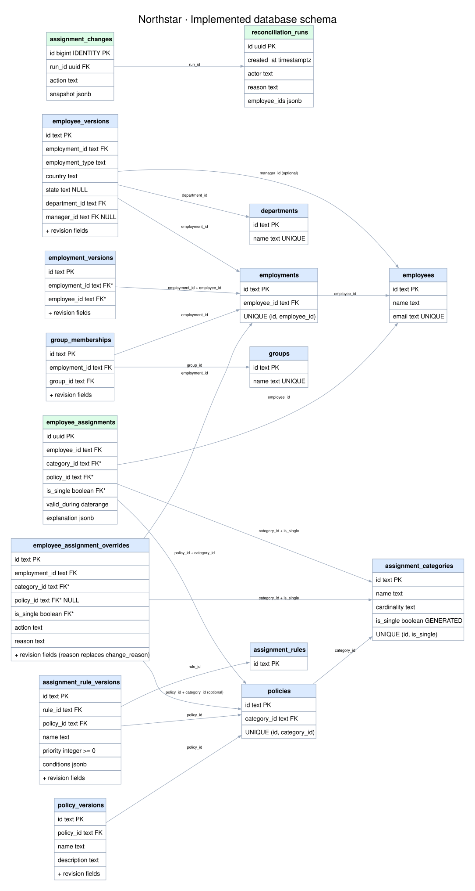

# Northstar database schema

This is the implemented PostgreSQL schema from migrations `0001`–`0003`, covering all 16 application tables. It excludes Alembic's migration-tracking table. The earlier schema proposal describes some deferred features; this diagram reflects the actual migration definitions.



[Open full-size SVG to zoom](diagrams/database-schema.svg) · [Editable Graphviz source](diagrams/database-schema.dot) · [System diagram](system-diagram.md)

Arrows run from the referencing child table to the referenced parent. Each child references one parent, or zero/one when the reference is optional; a parent can have zero or many children. `PK` means primary key, `FK` means foreign key, and `FK*` identifies a component of a composite foreign key. Fields are required unless marked `NULL` or described as nullable below. JSON contents are evidence or application-validated data, not relational foreign keys.

## Shared revision fields

To keep the diagram readable, `+ revision fields` expands to these actual columns on `employment_versions`, `employee_versions`, `group_memberships`, `policy_versions`, `assignment_rule_versions`, and `employee_assignment_overrides`:

| Column | PostgreSQL type | Meaning |
| --- | --- | --- |
| `effective_from` | `date NOT NULL` | Inclusive start |
| `effective_to` | `date NULL` | Exclusive end; null is unbounded |
| `created_at` | `timestamptz NOT NULL DEFAULT now()` | Recording time |
| `created_by` | `text NOT NULL` | Actor label |
| `change_reason` | `text NOT NULL` | Revision reason; overrides use `reason` instead |
| `superseded_at` | `timestamptz NULL` | When a revision was superseded |
| `superseded_by` | `text NULL` | Superseding actor label, not a foreign key |
| `superseded_reason` | `text NULL` | Supersession reason |

All three supersession fields must be null together or populated together. A trigger prevents deletion and business-value changes on recorded revisions; only one-time supersession metadata may change. Superseded rows retain evidence but are excluded from the current input set. Effective time and recording time are distinct; this does not implement a general bitemporal query API.

## Table responsibilities

| Area | Tables | Purpose |
| --- | --- | --- |
| Employee identity | `employees`, `employments` | Stable person identity and separate employment identities |
| Employee facts | `employment_versions`, `employee_versions` | Dated employment spans and attributes, including department and optional manager |
| Memberships | `departments`, `groups`, `group_memberships` | Lookup catalogs and dated group participation scoped to an employment |
| Policy catalog | `assignment_categories`, `policies`, `policy_versions` | Category cardinality, stable policy identities, and dated labels/descriptions |
| Automatic rules | `assignment_rules`, `assignment_rule_versions` | Stable rule identities and dated targets, priorities, names, and JSON conditions |
| Manual exceptions | `employee_assignment_overrides` | Employment-scoped set/add/exclude/clear revisions |
| Computed results | `employee_assignments` | Materialized date ranges with captured explanation evidence |
| Outcome history | `reconciliation_runs`, `assignment_changes` | Actor/reason/population and immutable-result snapshots of added/removed intervals |

`assignment_rules` has only an ID; the rule name belongs to its revision. `assignment_changes.snapshot` preserves result data without a foreign key to a live assignment row, so removed results remain explainable. `reconciliation_runs.employee_ids` is JSON, not a join table. Neither history table has the input revision immutability trigger; the application inserts history records rather than revising them.

## Database constraints and application validation

All effective intervals use `[start, end)` semantics and require the end to follow the start when present. PostgreSQL GiST exclusion constraints, supported by `btree_gist`, reject overlapping nonsuperseded input revisions within these scopes:

| Table | Non-overlap scope |
| --- | --- |
| `employment_versions` | Employee, including across distinct employment identities |
| `employee_versions` | Employment |
| `group_memberships` | Employment + group |
| `policy_versions` | Policy |
| `assignment_rule_versions` | Rule |
| `employee_assignment_overrides` | Employment + category for single categories; employment + policy for many categories |

The composite `(employment_id, employee_id)` foreign key on `employment_versions` ensures the version belongs to the correct person. Both assignments and overrides carry composite references to `(category_id, is_single)` and `(policy_id, category_id)` so category cardinality and policy ownership cannot disagree. Category `is_single` is generated from `cardinality <> 'many'`.

Stored assignment ranges must be nonempty and have a bounded lower end. Exclusion constraints prevent overlapping assignments per employee/category for single categories and per employee/policy for every category. Ensuring **exactly one**, rather than at most one, is a resolver coverage check performed before commit.

Category cardinalities are `exactly_one`, `at_most_one`, and `many`. Override actions are `set`, `add`, `exclude`, and `clear`; only `clear` has a null policy. SQL enforces set/clear for single categories and add/exclude for many categories. Application validation additionally disallows clear for required categories, verifies policy availability throughout the override, and ensures employment containment. Rule condition semantics and reporting-cycle checks also live in the application.

## Tradeoffs and rendering

Immutable input revisions and JSON result snapshots preserve explanations without a generic audit subsystem. JSON rules keep storage compact but rely on the typed field registry for validation. Materialized results accelerate reads while adding reconciliation work on writes. Stable employment identities keep membership and override scope separate across employment periods.

Source of truth: [directory/catalog migration](../backend/migrations/versions/0001_directory.py), [rules/assignments migration](../backend/migrations/versions/0002_assignments.py), and [override migration](../backend/migrations/versions/0003_overrides.py).

Render from the repository root with Graphviz:

```sh
dot -Tsvg docs/diagrams/database-schema.dot -o docs/diagrams/database-schema.svg
```
