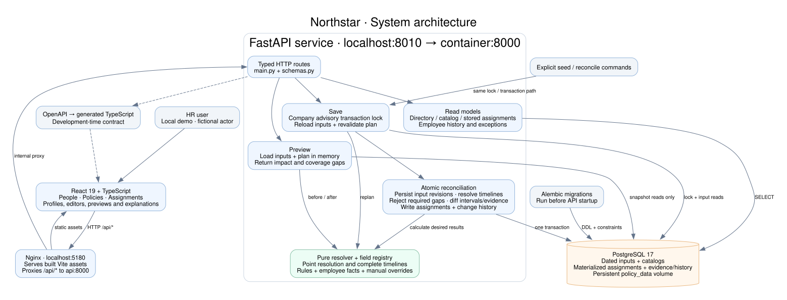

# Northstar system diagram

The implemented application runs as three Docker Compose services: a web server, an API, and PostgreSQL. This diagram describes the current code, including employee, override, and rule authoring.

[Open full-size SVG](diagrams/system.svg) · [Editable Graphviz source](diagrams/system.dot) · [Database schema](database-schema.md)

## Request and data flow

1. HR uses the React application served by Nginx at `localhost:5180`. Nginx forwards `/api/*` requests to FastAPI. The API is also exposed at `localhost:8010`; local Vite development proxies directly to that port.
2. Read endpoints query directory/catalog data and stored assignment intervals. Timeline reads include explicit exclusions and clears from override revisions; employee history is projected from existing revisions. Multi-query report, timeline, and history reads use a repeatable-read snapshot.
3. Preview endpoints load a consistent input snapshot and construct proposed changes in memory. The pure resolver calculates before/after results and missing required assignments without writing to the database.
4. Save endpoints acquire a company-wide PostgreSQL advisory transaction lock before reading inputs. They reload and revalidate the command, persist revisions, and reconcile assignments in the same transaction. A preview is informative; save validates against the inputs that exist when the lock is acquired.
5. Reconciliation compares complete timelines and their explanations. It writes only changed intervals, recording removals/additions in `assignment_changes` under a `reconciliation_runs` record. A no-op creates neither record type. Unresolved required coverage gaps abort the transaction.

The resolver in `resolver.py` is a function over in-memory inputs and explicit dates. It does not query the database or clock. Finite change boundaries include dated inputs, tenure thresholds, and reporting relationships; the last assignment interval may be unbounded. No scheduled job is needed to advance assignments as time passes. The API's configurable clock supplies the default UI date and edit-date validation.

## Tradeoffs

| Stored dated assignments rather than live-only evaluation | Predictable date reads and future transitions; inspectable results. | More storage and write-time computation, especially for explanation changes. |
| Company-wide write lock | Straightforward race prevention and rollback behavior. | Writers serialize; not appropriate for high write throughput. |